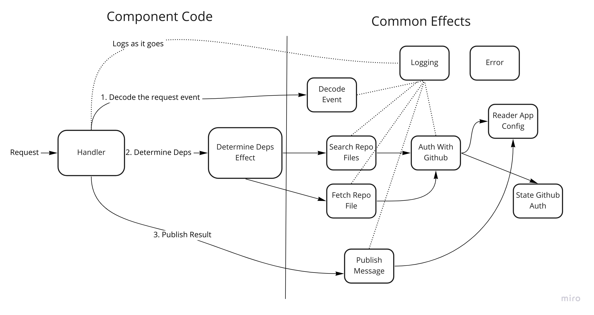

# Deadpendency Architecture

High level overview of how the Deadpendency works.

## How Does It Work?

### Simplified

1. A git push event occurs and GitHub calls the Deadpendency webhook.
2. The repositories' dependencies are determined.
3. Those dependencies get enriched with info from the package registry + source repository.
4. This enriched info is then assessed for project health.
5. A HTML report is written as a GitHub 'check run' report.

### Full complexity

😱 Your brain is probably melting out your ears at this point. This probably looks like massive overkill for the problem. It may be 😅. However, a lot of the complexity is reduced as this is a monorepo and all the components share a lot of code and are deployed together. A component is essentially just a function which takes in an input message and produces an output message.

Let's drill into each component a bit.

#### Front Proxy

Act as a nginx reverse proxy simply to enable [blue / green deploys](https://en.wikipedia.org/wiki/Blue-green_deployment).

This is necessary as a given deploy can change the schema of the messages passed between the components. If the components are updated in place you can have scenario where an old component version writes messages with the old schema and the new component version picks up that message, which will 💥.

In theory, the proxy should not be needed as the google cloud dns entry can just point at the blue / green versions of the front door api. However, it seems this involves downtime for some reason.

#### Front Door

Load the github push event details into a google pubsub message, doing a minimum of processing.

It is useful to have such a low logic/unlikely to fail component, as if this fails it is much harder to replay the message from GitHub. If any component after this fails, we can easily use pubsub retries or other mechanisms to replay.

#### Check Run Creator

Create the [GitHub check run](https://github.com/deadpendency/deadpendency-example/pull/1/checks) which houses the report and serves as the communication mechanism to the user.

This component also has minimal logic as if it fails, we have no way to communicate to the user about that failure, which is a really poor experience.

#### Run Preparer

1. Fetch and validate the user [plan](https://deadpendency.com/pricing), checking Deadpendency has not been installed to too many private repositories. Actually rejecting the run was never enabled.
2. Fetch the [Deadpendency config](https://deadpendency.com/docs/config).

#### Deadpendency Determiner

1. Based on the languages in use in the repository search and load dependency files.
2. Parse those files and look for any dependencies.
3. Also load dependency files + dependencies included in the Deadpendency config.

#### Deadpendency Fetcher

1. Fetch key details about the dependencies from the package registry (eg. when was the last release).
2. Fetch key details from the source repository (eg. when was the last commit).

#### Report Generator

1. Assess each dependency using various health checks (eg. was the last release within 2 years).
2. Give each dependency a fail, warning or success result.
3. Give the overall report a fail or success result.

#### Run Finalizer

1. Convert the report result into an HTML report.
2. Write the HTML to the GitHub check run as the result.

#### Error Reporter

At times a component will hit an unexpected scenario and processing will halt with a failure. This will be retried 5 times, but if it is still failing the message will go to a dead letter queue (DLQ).

We want in this case to communicate to the user that a failure has occurred which will be investigated. Once the error is fixed, the report will automatically be re-run.

The Error Reporter takes messages from the DLQs and writes out a final report result of "Sorry we had a 💥", which the run finalizer communicates back to the user via the check run.

#### Script Runner

A lot of ad hoc tasks often devolve into bash scripts which are run locally or from the CI agents. I prefer the model where they are run from the application and triggered in some fashion, which is what the script runner is. For example, it can replay failed messages if an HTTP request is made to the `/replay-failed` endpoint.

##### Replay Failed Task

If we have failure to process messages, we often want to replay those after the bug has been fixed / the external service is back up. This goes through each DLQ and puts the messages back on to the regular queue for processing.

##### Smoke Test

There is an end to end smoke test that runs post deploys (it used to run all the time, but I switched it off to save 💰). It:

1. Using the GitHub API, trigger a re-run of certain check runs, for given smoke test repositories.
2. Poll the check run report, looking for an updated report.
3. Once recieved, decode the HTML report and verify it looks as expected.

##### Emit Total Installs Metric

There is a dashboards where I show the total installs. This runs periodically and emits the total Deadpendency installs as a metric.

## Structure

As noted, it is written in a 'microservices as a monorepo' style. This may seem like it has a lot of complexity overhead. However, key to the approach is that a common framework is written that makes it very cheap to write / maintain a given microservice.

Microservices itself is probably the wrong name here. Google cloud run can be thought of AWS lambda but for docker. Each component is effectively a single function that takes in one input and produces one output.

### What Each Component Needs

* A [servant](https://docs.servant.dev/en/stable/) handler.
* At least one Effect to do its job.
* Terraform configuration (boilerplate heavy, but easy to set up)

That is it.. The shared boilerplate that lives in the 'common' package handles the rest, such as decoding the input message or writing out the result message.

There is still a bit of boilerplate in each component, however it is easy to set up and just works from then on out.

### Effect Structure

Part of the reason this has been quite manageable is as much as possible the code has been pushed into the common package. It houses a bunch of common types, functions and 'effects' which are highly reusable.

An individual component can focus on its own logic, in the above case, the parsing of dependency files. Common concerns like logging, tracing, message passing and authing/talking to GitHub API are abstracted away.

#### Effect Internal Structure

Internally effects are structured as follows.

Nothing about this is too interesting. The most notable point is the business logic is split into 'backends' which is where most of the unit testing occurs.

#### Why Use Effects?

The most simple way to implement a program when not using composed monadic effects is simply to pass arguments to functions. This is nice and simple and recommended for simpler programs. However, if you look at the (simplified) effect dependency graph above, you can probably appreciate how this would start to become cumbersome at best.

For example, you would need to pass GitHub auth details through many layers of functions to the 'installation auth' function, so it can get a session token with GitHub. This would mean for example that the 'determine dependencies' function would need to receive and pass these details down to lower functions and so on. This problem also extends when writing tests, lower level details would need to be passed in when testing high level functions.

Monadic effects greatly improve upon this situation where the `DetermineDepenenciesEffect` only needs to depend upon the direct effects it uses. They only need to be included in tests when testing the effect. Nor of course, is there a need to pass through details to lower level effects.

You might think that this 'implicit' passing means that you can forget to actually provide the config or other requirements to these effects. That is not the case though, if they are not provided it will be a compilation error.

Admittedly this is mostly about the benefits of Reader. Beyond this, effects, in particular low level reusable ones like State and just elegant ways to provide powerful abstractions with reusable logic in a pure package. Once understood, they are easy to use and remove a lot of boilerplate and potential source of bugs by implementing these features in a custom way.

#### Why Not Use Effects?

The cost of effects is an increase in complexity. They are not easy to understand and it takes time to get your head around it, squinting at compilation failures. The compilation errors you do get, can be a lot harder to understand as well.

Fused effects in particular, I found challenging. The method for writing your effect 'interpreters' is as a typeclass instance, which I found less intuitive than something like polysemy. I knew this when I chose fused effects, but I wanted something reliable and I knew fused effects was used in [semantic](https://github.com/github/semantic) which I'm sure runs very reliably.

## Reflections

What do I think of the various architectural choices at the end of the project.

### A Lot Of Components

I think this worked out great.

* It enforced very clear boundaries between the various parts of the application.
* It forced a lot of the common logic into common code, rather than hack and borrow across module boundaries.
* It meant when things failed (including exceptional failures), it was very clear which part had failed. It also meant I could just retry that component rather than replay all the steps.
* It meant each component was very easy to size. All but the dependency fetcher could be the smallest possible GCP cloud run size of 256MB.

There were downsides, such as cost. However, cloud run is so cheap this is barely noticeable. My biggest cost by far was the smallest possible Redis instance available in GCP.

### Effects

This cost quite a lot of time to understand and set up. However, I do think the end result was excellent and paid off over time.

Having said that, I would be hesitant to go this route if I had a team who had to also understand them. Then you might have attrition on that team, or juniors joining etc. In these kind of scenarios, I would probably not recommend 'extensible effects', but rather [MTL](https://hackage.haskell.org/package/mtl) or the ['ReaderT IO' pattern](https://www.fpcomplete.com/blog/2017/06/readert-design-pattern/).

#### Concurrent IO

There was one big pain point with effects (possibly just fused-effects I am not sure), which was concurrent IO. The problem was, I wanted to use effects all the way down, however at certain points I wanted to use concurrent IO. For example, I wanted to download the repository dependency files in parallel.

Fused effects didn't seem to have a [clear way to support this](https://github.com/fused-effects/fused-effects/issues/357). There was some support for `async` [package](https://github.com/patrickt/fused-effects-async) with fused effects, but this did not have the ability to limit concurrency. I could have spent more time down this path, but I felt a bit out of my depth. In general it sounds like effects + async (exceptions) is a bit of an unsolved problem in terms of what the correct semantics are.

As such, when I had this requirement, from that effect down it would just operate in IO. This made these parts of the code much tricker to test and I mostly just didn't bother. This has lead to some quite bloated effects, which could be broken down into smaller effects.

I'm not sure what the answer is. Perhaps this is just a downside of effects or there may be an elegant way to solve this.
